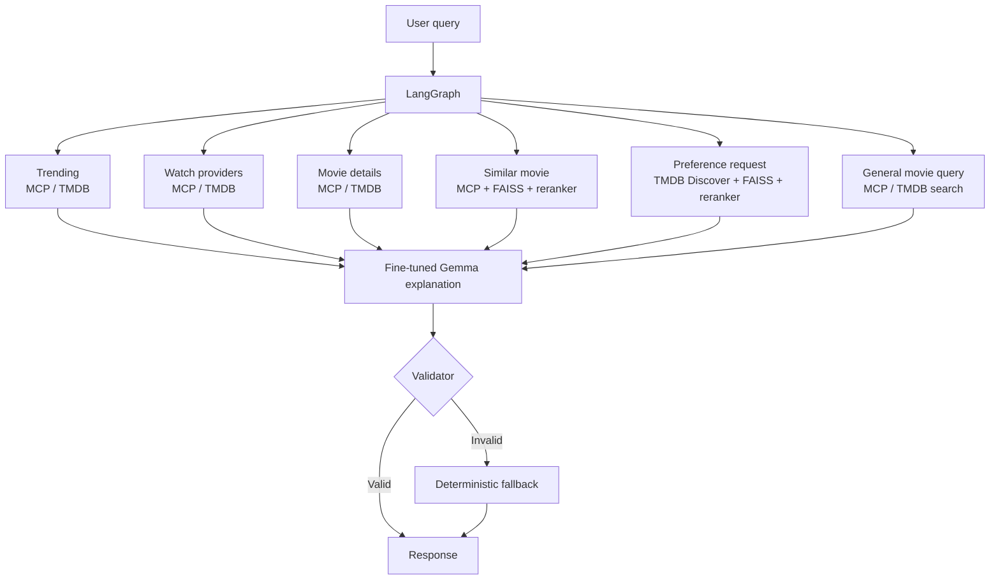

# Movie Blasters — Hybrid LLM Movie Recommender

Movie Blasters is a full-stack movie assistant that combines live TMDB tools,
local FAISS retrieval, explicit recommendation scoring, diversity reranking,
LangGraph orchestration, and a QLoRA-fine-tuned Gemma response synthesizer.

The system separates **movie selection** from **language generation**:

- Retrieval and deterministic scoring decide which movies are recommended.
- The fine-tuned model explains the final ranked movies without changing them.
- A deterministic formatter remains available if model synthesis fails validation.

## Features

- React and TypeScript chat interface backed by FastAPI
- LangGraph request orchestration with deterministic intent routing
- MCP client/server integration for live TMDB tools
- TMDB and local FAISS candidate generation
- Four-signal item-to-item reranking
- Preference-based recommendations for genre and year constraints
- Diversity reranking to reduce repetitive results
- QLoRA-fine-tuned Gemma model for grounded recommendation explanations
- Strict output validation with deterministic fallback formatting
- MLflow tracking, automated tests, linting, and GitHub Actions

## Architecture



### Supported routes

| Intent | Example | Execution path |
|---|---|---|
| Similar movies | `Movies like Interstellar` | MCP + FAISS → ranking → synthesis |
| Preference recommendation | `Recommend recent sci-fi movies` | TMDB Discover + FAISS → preference ranking → synthesis |
| Trending | `What is trending this week?` | MCP → TMDB |
| Watch providers | `Where can I watch Dune?` | MCP → TMDB providers |
| Movie details | `Who directed Arrival?` | MCP → TMDB details |
| General movie query | `Inception` | MCP → TMDB search → synthesis |

## Recommendation Pipeline

For source-movie requests, TMDB and FAISS produce candidate movies. Candidates
are merged by TMDB ID, deduplicated, and ranked using four signals:

| Signal | Default weight | Purpose |
|---|---:|---|
| Overview embedding similarity | 0.60 | Matches plot and themes semantically |
| TMDB keyword similarity | 0.25 | Captures topics, motifs, and concepts |
| Genre overlap | 0.10 | Rewards shared genres |
| Collection match | 0.05 | Identifies franchise or series relationships |

If metadata is missing, the score is normalized over the available signals.
The diversity stage then applies maximal marginal relevance so the final five
movies stay relevant without becoming overly repetitive or franchise-heavy.

## Fine-Tuned Response Synthesis

Grounded data and recommendation routes pass their retrieved result to Gemma 3
1B with a QLoRA adapter. Recommendation routes provide only the query, source movie or
preferences, and approved recommendation metadata; the model cannot select,
remove, or reorder movies. TMDB information routes provide the complete
verified answer and require the model to preserve it verbatim.

Production inference extracts one generated explanation paragraph for each
approved movie and reconstructs the ranked response deterministically. This
removes trailing model output while preserving the generated explanations. If
loading, generation, or validation fails, LangGraph follows the deterministic
fallback node and returns the formatter's verified response.

## Technology Stack

| Layer | Technology |
|---|---|
| Frontend | React 19, TypeScript, Vite |
| API | FastAPI, Pydantic, Uvicorn |
| Orchestration | LangGraph |
| Tool protocol | Model Context Protocol (MCP) |
| Live movie data | TMDB API |
| Vector retrieval | FAISS, LangChain |
| Embeddings | SentenceTransformers `all-MiniLM-L6-v2` |
| Synthesis model | Gemma 3 1B IT + QLoRA adapter |
| Training | Transformers, TRL, PEFT, bitsandbytes |
| Monitoring | MLflow |
| Quality | pytest, Ruff, pre-commit, GitHub Actions |

## Getting Started

### Prerequisites

- Python 3.11
- Node.js 20.19+ or 22.12+
- A TMDB bearer token
- A Hugging Face account with access to the configured Gemma synthesis model
- An NVIDIA GPU for QLoRA training; inference can run on CPU

### 1. Clone and install the backend

#### Windows PowerShell

```powershell
git clone https://github.com/shrsai123/LLM_Movie_Recommendation.git
cd LLM_Movie_Recommendation

py -3.11 -m venv .venv
.\.venv\Scripts\python.exe -m pip install --upgrade pip
.\.venv\Scripts\python.exe -m pip install -r requirements.txt
```

Using the virtual environment's Python executable directly prevents commands
from accidentally using a different global Python installation. Activation is
optional.

#### macOS or Linux

```bash
git clone https://github.com/shrsai123/LLM_Movie_Recommendation.git
cd LLM_Movie_Recommendation

python3.11 -m venv .venv
./.venv/bin/python -m pip install --upgrade pip
./.venv/bin/python -m pip install -r requirements.txt
```

Create a `.env` file in the repository root:

```env
TMDB_BEARER_TOKEN=your_tmdb_bearer_token
HF_TOKEN=your_hugging_face_token
```

Alternatively, authenticate with the Hugging Face CLI on Windows:

```powershell
.\.venv\Scripts\hf.exe auth login
```

### 2. Build the FAISS index

Place the TMDB movies and credits CSV files at the paths configured in
`config.yaml`.

Windows:

```powershell
.\.venv\Scripts\python.exe scripts\build_index.py
```

macOS or Linux:

```bash
./.venv/bin/python scripts/build_index.py
```

### 3. Start FastAPI

Run the API from the repository root. The model-heavy backend intentionally
does not use auto-reload because reload workers can duplicate model processes
and GPU or system-memory usage.

Windows:

```powershell
.\.venv\Scripts\python.exe -m uvicorn api.main:app --host 127.0.0.1 --port 8000
```

macOS or Linux:

```bash
./.venv/bin/python -m uvicorn api.main:app --host 127.0.0.1 --port 8000
```

Useful endpoints:

- API documentation: <http://127.0.0.1:8000/docs>
- Health check: <http://127.0.0.1:8000/api/v1/health>
- Chat endpoint: `POST /api/v1/chat`

### 4. Start the React frontend

Open another terminal.

Windows PowerShell:

```powershell
cd frontend
npm.cmd ci
npm.cmd run dev
```

macOS or Linux:

```bash
cd frontend
npm ci
npm run dev
```

Open <http://localhost:5173>. Vite proxies `/api` requests to FastAPI on port
8000.

## Configuration

Ranking and synthesis behavior is controlled in `config.yaml`:

```yaml
ranking:
  candidates:
    tmdb: 20
    faiss: 20
    final: 5
  diversity:
    enabled: true
    candidate_pool: 15
    relevance_weight: 0.85
    max_per_collection: 2
  weights:
    overview: 0.60
    keywords: 0.25
    genres: 0.10
    collection: 0.05

post_training:
  synthesis:
    enabled: true
    base_model: "google/gemma-3-1b-it"
    adapter_path: "artifacts/recommendation-synthesis-adapter"
    device: "cpu"
    quantize_4bit: true
    max_new_tokens: 250
    fallback_to_formatter: true
```

Set `post_training.synthesis.enabled` to `false` to use deterministic formatting
without loading the synthesis model.

## Build and Train the Synthesis Adapter

The current `requirements.txt` includes the training dependencies. The dataset
builder reads source movies from `evaluation/sources.json`, fetches TMDB
candidates through MCP, applies the production ranking pipeline, and writes
source-separated JSONL splits.

Windows:

```powershell
.\.venv\Scripts\python.exe -m training.build_synthesis_dataset
.\.venv\Scripts\python.exe -m training.train_synthesis_qlora
.\.venv\Scripts\python.exe -m training.evaluate_synthesis
```

macOS or Linux:

```bash
./.venv/bin/python -m training.build_synthesis_dataset
./.venv/bin/python -m training.train_synthesis_qlora
./.venv/bin/python -m training.evaluate_synthesis
```

Generated dataset files:

```text
data/synthesis/train.jsonl
data/synthesis/dev.jsonl
data/synthesis/holdout.jsonl
```

Review the generated `reference_answer` values before training. The adapter is
saved to:

```text
artifacts/recommendation-synthesis-adapter/
```

Evaluation writes the detailed comparison to:

```text
evaluation/synthesis_comparison.json
```

Reported metrics include candidate coverage, rank-order preservation, exact
format validity, unexpected-heading rate, reference token F1, generation error
rate, and average latency.

## Tests and Code Quality

Windows:

```powershell
.\.venv\Scripts\python.exe -m pytest tests -v
.\.venv\Scripts\python.exe -m ruff check src api scripts mcp_server training
.\.venv\Scripts\python.exe -m ruff format --check src api scripts mcp_server training

cd frontend
npm.cmd run lint
npm.cmd run build
```

macOS or Linux:

```bash
./.venv/bin/python -m pytest tests -v
./.venv/bin/python -m ruff check src api scripts mcp_server training
./.venv/bin/python -m ruff format --check src api scripts mcp_server training

cd frontend
npm run lint
npm run build
```

GitHub Actions runs backend linting and tests, frontend linting and builds, and
Docker image validation on pushes to `main`.

## Core Project Layout

```text
api/                          FastAPI endpoints and schemas
frontend/                     React and TypeScript client
mcp_server/                   TMDB MCP tools and API client
src/workflow.py               LangGraph orchestration
src/hybrid_assistant.py       Route execution and recommendation pipeline
src/recommender.py            Four-signal item-to-item reranker
src/preference_recommender.py Preference-based ranking
src/diversity.py              Diversity reranking
src/response_synthesizer.py   Fine-tuned response generation and validation
training/                     Dataset, QLoRA training, and evaluation scripts
tests/                        Backend unit and integration tests
config.yaml                   Retrieval, ranking, and model configuration
```

## Docker Status

The existing Dockerfile and Compose configuration still launch the legacy
Gradio application on port 7860. They must be updated to package FastAPI and
the React frontend before they should be used for this full-stack interface.

## Design Principles

1. **Retrieval and ranking select movies; the LLM explains them.**
2. **MCP isolates external TMDB capabilities behind explicit tools.**
3. **LangGraph makes routing and execution observable.**
4. **Validation prevents the synthesis model from silently changing results.**
5. **Deterministic fallbacks keep recommendation requests available.**
